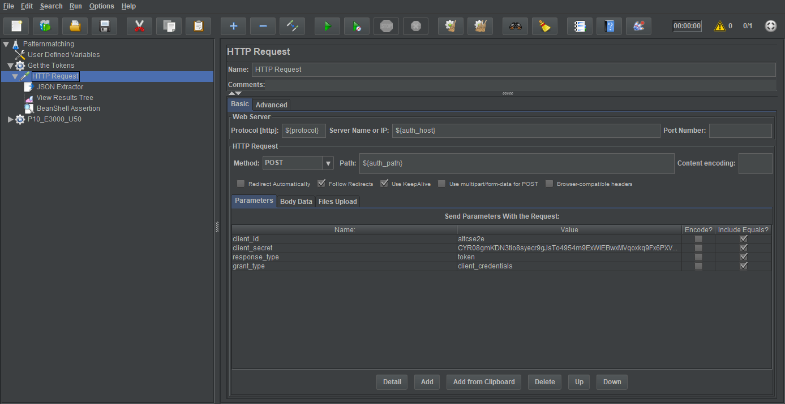
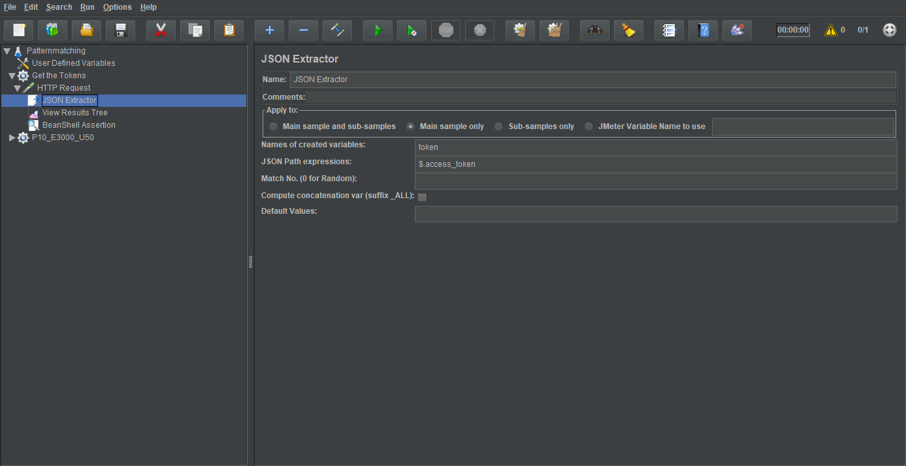
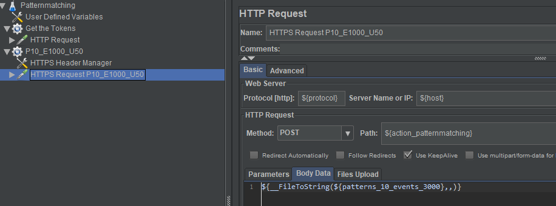
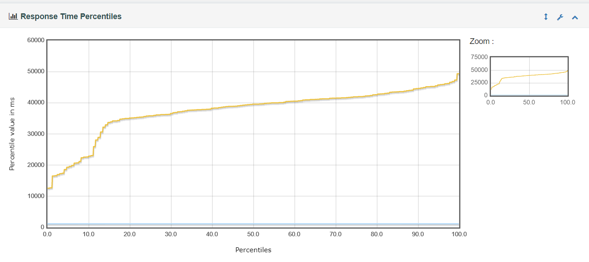

# Performance Testing Using Apache JMeter
## Getting Start
- Download and install Apache JMeter from <http://jmeter.apache.org/download_jmeter.cgi>.
- Get a quick start at [Performance testing tutorial (step by step)](https://gojira.siemens.com/mindsphere_wiki/pages/viewpage.action?pageId=43426712),
and you can get a full help at official website <https://jmeter.apache.org/usermanual>

## Example case for pattern matching
- Here we explore a more completely one. Download the example JMX [Patternmatching.jmx](./Patternmatching.jmx) and open it in your JMeter. In the first step we configure some variables and these variables can be refered by ${variable_key} in Jmeter. Then get web token from auth server before we start loading test, add a Thread Group and configure a HTTP Request as below.
  
- Once the token is delivered by response body, in next step JSON Extractor will be helpful, JSON Extractor is a tool inside Jmeter and it can parse the response body, we can use it getting the token. There is a farther explore for you about how to extract data from JSON: <https://octoperf.com/blog/2017/03/09/how-to-extract-data-from-json-response-using-jmeter>, once we get the specific data we can set it to Jmeter variables by `${__setProperty(token, ${token})}` in BeanShell and simply use it by `${__property(token)}` in another Thread Group. 
- Remember configure token in the Header of loading testing Request. For many requests body is pretty large so we choose read it from file,  there is another useful function for parametrization `__FileToString`. As its name suggests, this function reads the entire file every time it is called and stores it in a JMeter variable when data is inserted in the Variable Name parameter. In this case, we use `${__FileToString(${patterns_10_events_3000},,)}` reading data from file `patterns_10_events_3000`, this input file contains 10 patterns, 3000 events for current request.

- Open terminal type `jmeter -n -t Patternmatching.jmx -l Patternmatching.csv -e -o result` to start test. ` Patternmatching.csv` is log file samples which could be use for further analyzing, there is also a [report dashboard](./result/index.html) after loading test.

## Distributed Testing
Distributed testing allows for testing in a distributed environment. In a typical distributed environment, there are different machines each running a test engine instance and controlled by one primary machine or node. Distributed testing comes in handy when you have large number of users to simulate and test and a single machine is not good enough to handle such load. You can distribute the tests on different nodes The different nodes are controlled or managed by one single client node.

#### Start slave nodes
- visit /bin directory to edit jmeter.properties file, disable JMeter running on a remote server over SSH by `server.rmi.ssl.disable=true`
- on each slave node start JMeter server with `apache-jmeter-4.0/bin/jmeter-server -Djava.rmi.server.hostname=${slave_ip}`

#### Start master  
- visit /bin directory to edit jmeter.properties file, disable JMeter running on a remote server over SSH as last step, adds IP slave machine as shown below: `remote_hosts=${slave_ips}`
- then start loading test with   
`apache-jmeter-4.0/bin/jmeter -n -t /home/jmeter_master/jmeter/plan/Patternmatching.jmx -l /home/jmeter_master/jmeter/results/Patternmatching.csv -e -o /home/jmeter_master/jmeter/results/ -X -r`

## Troubleshooting
- Always open jmeter(Unix)/jmeter.bat(Windows) to use Jmeter.
- Don't use GUI mode for load testing, only for Test creation and Test debugging.
- if you get problems such as Master won't shut down, you can start master with `apache-jmeter-4.0/bin/jmeter -n -t /home/jmeter_master/jmeter/plan/Patternmatching.jmx -l /home/jmeter_master/jmeter/results/Patternmatching.csv -e -o /home/jmeter_master/jmeter/results/ -X -r -Djava.rmi.server.hostname=${host_ip}`
- when distributing test reading request data from file, be careful the data path all the same on each nodes.
