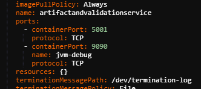
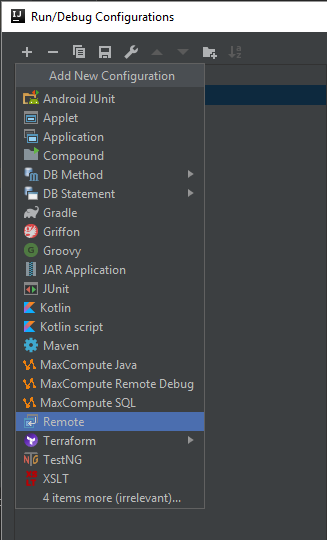

# Remote Debug K8s Java Application

This page provide a way to using IDEA detach debug mode to debug java application that runs on Alibaba K8s cluster.

## Recommended Way

1. Install **kubectl**, get kubeconfig and write to file `~/.kube/config`, then you can get cluster information by running `$ kubectl cluster-info`
    ``` bash
    $ curl -LO https://storage.googleapis.com/kubernetes-release/release/v1.12.0/bin/windows/amd64/kubectl.exe
    ```

    then add to system env.
2. From **IDEA**, create remote debug attaching to `localhost:<port>`, you will get JDK5~8 command line arguments `-agentlib:jdwp=transport=dt_socket,server=y,suspend=n,address=9090`

3. Update **Dockerfile** to add arguments  
    ```
    FROM openjdk:8-jdk-alpine
     
    ARG JAVA_ENABLE_DEBUG=false
    ENV JAVA_ENABLE_DEBUG ${JAVA_ENABLE_DEBUG}
     
    ADD ./dockerdemo-0.0.1-SNAPSHOT.jar demo.jar
     
    ENTRYPOINT if [ "${JAVA_ENABLE_DEBUG}" = "true" ]; then \
                   java -agentlib:jdwp=transport=dt_socket,server=y,suspend=n,address=9090 -Djava.security.egd=file:/dev/./urandom -jar /demo.jar; \
               else \
                   java -Djava.security.egd=file:/dev/./urandom -jar /demo.jar; \
               fi
     
    EXPOSE 8080
    ```

4. Update K8s Pod **yaml** file and add JAVA_ENABLE_DEBUG as true
    ```
        ports:
           - containerPort: 5000
             protocol: TCP
          - containerPort: 9090
             name: jvm-debug
             protocol: TCP
    ```
    

5. After started, getting pod by running `$ kubectl get pod [-o wide]` and forward local port to remote port by running `$ kubectl port-forward <pod> <localpot>:<remoteport>`

6. Run remote debug from IDEA, you will get `Connected to the target VM, address: 'localhost:9090', transport: 'socket'` upon success.

## Another Way

1.  open project configuration


2.  add remote debug


3.  made the settings as marked by yellow
    Host & Port is the IP address of the service external endpoints in k8s.
    

4. get the "Command Line arguments for remote JVM" in above screenshot and put into your Dockerfile as below:
    CMD ["java","-jar","-agentlib:jdwp=transport=dt_socket,server=y,suspend=n,address=5000","-Djava.security.egd=file:/dev/./urandom","/devcockpitsvc-3.0.5.jar"]
5. build docker image and deploy.

6. (might needs)restart service in k8s

    

    

    to restart service need to kill it 

      
7.  start the remote debug task when your service starts to run, and you will see connected:
    
